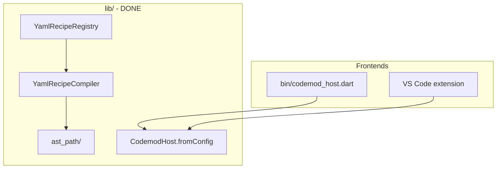

# YAML AST DSL — Plan & Status

Canonical spec for YAML recipes and the navigate + anchor DSL. **Implementation lives on branch `feature/yaml-ast-dsl`.**

---

## Implementation status (2026-06-15)

### Done (functional via CLI / stdio host)

| Area | Modules | Tests |
|------|---------|-------|
| AST path v1 | `lib/src/ast_path/` | `test/ast_path/` (12) |
| YAML load/compile | `lib/src/yaml/recipe_compiler.dart`, `recipe_registry.dart` | `test/yaml/` (8) |
| Host protocol | `reload`, `validate`, `diagnostics` on `list` in `codemod_host.dart` | `test/yaml/codemod_host_yaml_test.dart` |
| Generic entrypoint | `bin/codemod_host.dart` | manual + host tests |
| Builtin transforms + AstPath | `resolveClassFocus`, `StringResolver` on transforms | existing + generic transform tests |
| Example recipes | `.codemod/recipes/*.yaml` | copy of test fixtures |

### Not done

- Bundled compiled host binary in extension
- v2 navigate/anchor (`field:`, `param:name:`, `doc:before`, …)

### Merge-ready (done)

- `addConstructorParam` YAML step
- `buildRunner` post-execution builtin in YAML compiler
- `FieldConstructorArgs.style` nullable — respects `CodemodPreferences.emptyConstructorStyle`
- Full test suite green (89/89)

### Phase 4 extension (done)

- Spawns `dart run bin/codemod_host.dart --stdio-server` with HostConfig CLI flags
- Settings: `recipesDirectory`, `templatesRoot`, `emptyConstructorStyle`
- Parses `diagnostics` from `list` / `reload`; shown in RecipesTab
- YAML recipe file watcher triggers `reload` (debounced)
- No YAML parsing in TypeScript

### Try it now

```bash
# From package root (branch feature/yaml-ast-dsl)
dart run bin/codemod_host.dart --validate

dart run bin/codemod_host.dart add_log_line \
  --file path/to/file.dart --className Settings --methodName update

dart run bin/codemod_host.dart --stdio-server
# stdin: {"command":"list"}
```

Default paths: recipes `.codemod/recipes`, templates `.codemod/templates` (workspace-relative).

### Test suite

- `dart test test/ast_path test/yaml` — 20/20 pass
- Full suite: 89/89

---

## Architecture (locked)



- **Core-first:** all YAML/AST logic in Dart; extension only spawns host and shows `diagnostics`.
- **ID collisions:** `E_DUPLICATE_RECIPE_ID` error; neither recipe registered.
- **Previews:** inferred from `create:` steps only (no `previewTemplates` in YAML).
- **Patches:** non-cumulative within one `edit:` block (all steps patch original snapshot).

---

## Key files

| Concern | Path |
|---------|------|
| AST path model/parser/interpreter | `lib/src/ast_path/` |
| Class focus from navigate steps | `lib/src/ast_path/class_focus.dart` |
| YAML compiler | `lib/src/yaml/recipe_compiler.dart` |
| Registry + collisions | `lib/src/yaml/recipe_registry.dart` |
| Host config | `lib/src/yaml/host_config.dart` |
| Diagnostics | `lib/src/yaml/diagnostics.dart` |
| Path sandbox | `lib/src/yaml/path_sandbox.dart` |
| Host reload/validate | `lib/src/vscode/codemod_host.dart` |
| CLI entry | `bin/codemod_host.dart` |
| Example YAML | `.codemod/recipes/` |
| Fixture tests | `test/fixtures/yaml_recipes/`, `test/fixtures/ast_paths/` |

---

## YAML recipe shape (summary)

```yaml
dslVersion: 1
id: my_recipe
name: my_recipe
args: [...]
steps:
  - recipe: other_recipe_id          # composition
  - edit:
      path: "{{file}}"
      steps:
        - insert: { at: [...], anchor: stmt:last, text: "..." }
        - addField: { at: [...], field: { name: "{{x}}", type: int } }
        - addMethod: { at: [...], name: foo, body: "..." }
        - addImport: package:foo/bar.dart
        - addAnnotation: { at: [...], annotation: "@override" }
        - addConstructorParam: { at: [...], name: foo, type: String }
  - create:
      path: "lib/{{name}}.dart"
      template: |
        ...
postExecution:
  - dartFormat
  - buildRunner
  - run: echo done
  - runScript: scripts/post.sh
```

---

## Next work (Phase 4 — extension)

1. Extension settings: `recipesDirectory`, `templatesRoot`, `codemodPreferences` → spawn args for host
2. Default host: `dart run bin/codemod_host.dart --stdio-server` (later: bundled binary)
3. Parse `diagnostics` from `list` / `reload`; show in `RecipesTab` / bootstrap
4. On YAML file save: send `{"command":"reload"}`
5. No YAML parsing in TypeScript

See full syntax spec in conversation plan history and `test/fixtures/` for working examples.

---

## Design decisions

| Topic | Choice |
|-------|--------|
| Core vs extension | All logic in `lib/` |
| CLI | Same `bin/codemod_host.dart` as extension will use |
| Collisions | Error + diagnostics JSON |
| Dart custom transforms | Coexist via `HostConfig.dartRecipes`; not a YAML syntax feature |
| Multi-step edit | Non-cumulative v1 |
