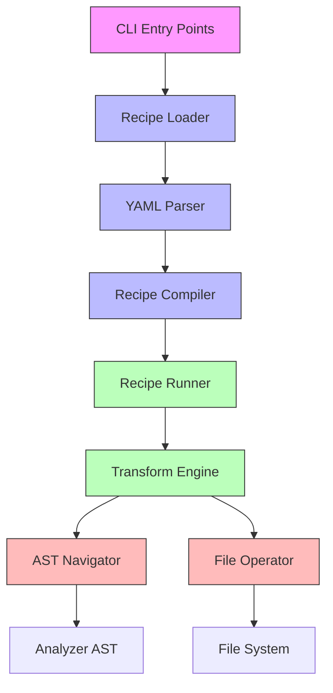

# Architecture Decisions for Codemod Recipe

This document captures key architectural decisions, design patterns, and rationale for the codemod_recipe package.

## Table of Contents

- [Core Principles](#core-principles)
- [Architecture Overview](#architecture-overview)
- [Key Design Patterns](#key-design-patterns)
- [Component Architecture](#component-architecture)
- [Error Handling Strategy](#error-handling-strategy)
- [Logging Strategy](#logging-strategy)
- [Type Safety Approach](#type-safety-approach)
- [Testing Strategy](#testing-strategy)
- [Performance Considerations](#performance-considerations)
- [Future Evolution](#future-evolution)

## Core Principles

### 1. Deterministic Transformations

**Decision**: All code transformations must be deterministic - given the same input, they must produce the same output.

**Rationale**: 
- Ensures reproducible builds and codemods
- Enables safe preview/dry-run functionality
- Makes testing straightforward and reliable
- Allows for caching and optimization

**Implementation**:
- `CodeTransform.apply()` is pure function (same inputs → same outputs)
- Context values are immutable during transform execution
- File operations are planned first, then applied atomically

### 2. Separation of Concerns

**Decision**: Clear separation between:
- Recipe definition (YAML/Dart)
- Recipe compilation
- Recipe execution
- AST navigation
- File operations

**Rationale**:
- Each component can evolve independently
- Easier to test components in isolation
- Clearer mental model for developers
- Better error isolation

### 3. Convention over Configuration

**Decision**: Provide sensible defaults and conventions, allow overrides only when necessary.

**Rationale**:
- Reduces cognitive load for users
- Makes common cases simple
- Still allows flexibility for advanced use cases
- Encourages consistent code style

## Architecture Overview



### Layered Architecture

1. **Presentation Layer**: CLI entry points (`bin/codemod.dart`, `bin/codemod_host.dart`)
2. **Application Layer**: Recipe loading, compilation, and execution
3. **Domain Layer**: Core abstractions (transforms, operations, context)
4. **Infrastructure Layer**: File system, AST parsing, YAML parsing

## Key Design Patterns

### 1. Strategy Pattern

**Used for**: Anchor validation, navigation step handling, argument validation

**Example**: `AnchorValidator` interface with concrete implementations:
- `ClassAnchorValidator`
- `MethodAnchorValidator`
- `FunctionAnchorValidator`
- `StatementAnchorValidator`

**Benefits**:
- Easy to add new anchor types
- Each validator encapsulates its own logic
- Runtime polymorphism for dynamic behavior

### 2. Builder Pattern

**Used for**: AST path construction, recipe building

**Example**: `AstPathBuilder` provides fluent interface:
```dart
final path = AstPathBuilder()
  .navigateToClass('Settings')
  .navigateToMethod('update')
  .build();
```

**Benefits**:
- Readable, declarative syntax
- Type-safe construction
- Immutable result

### 3. Template Method Pattern

**Used for**: Recipe execution lifecycle

**Example**: `CodemodRecipe.run()` template method that:
1. Validates arguments
2. Collects changes (abstract method)
3. Applies changes atomically
4. Runs post-execution hooks

**Benefits**:
- Consistent execution flow
- Subclasses focus on core logic
- Easy to add cross-cutting concerns

### 4. Registry Pattern

**Used for**: Recipe discovery and registration

**Example**: `YamlRecipeRegistry` scans directories for `.yaml` files and registers them

**Benefits**:
- Decouples recipe definition from discovery
- Supports multiple recipe sources
- Easy to extend with new recipe types

### 5. Functional Programming Patterns

**Used for**: Transformations, patch operations

**Examples**:
- Pure functions for transforms
- Immutable data structures
- Function composition
- Higher-order functions

**Benefits**:
- Easier reasoning about code
- Better testability
- Thread safety
- Deterministic behavior

## Component Architecture

### 1. Recipe System

```
Recipe Definition (YAML/Dart)
    ↓
Recipe Parser
    ↓
Recipe Compiler → CompiledRecipe
    ↓
Recipe Runner → Executes transforms
    ↓
File Changes Applied
```

**Key Components**:
- `YamlRecipeParser`: Parses YAML recipe files
- `YamlRecipeCompiler`: Compiles parsed recipes to executable form
- `CodemodRunner`: Executes compiled recipes
- `CodemodRecipe`: Base class for all recipes

### 2. AST Navigation System

```
AST Path String (e.g., "class:Settings > method:update")
    ↓
AstPathParser → NavigateStep[]
    ↓
AstPathInterpreter → AstFocus
    ↓
AnchorResolver → Insertion offset
```

**Key Components**:
- `AstPathParser`: Parses path strings into navigation steps
- `AstPathInterpreter`: Navigates AST using steps
- `AstFocus`: Represents current position in AST
- `AnchorValidator`: Validates and resolves anchor positions

### 3. Transform System

```
Source Code + Context
    ↓
CodeTransform.apply()
    ↓
List<SourcePatch>
    ↓
applyPatches()
    ↓
Modified Source Code
```

**Key Components**:
- `CodeTransform`: Interface for all transforms
- `FunctionTransform`: Simple function-based transforms
- `SourcePatch`: Represents a single code change
- `PatchHelpers`: Utilities for working with patches

### 4. Context System

```
CLI Arguments
    ↓
CodemodContext
    ↓
Used by Transforms & Templates
```

**Key Components**:
- `CodemodContext`: Stores argument values and utilities
- `ArgCodec`: Type conversion for arguments
- `TemplateContext`: Template rendering context

## Error Handling Strategy

### Error Classification

1. **User Errors**: Invalid input, missing arguments
   - `CodemodArgException`, `ValidationException`
   - Clear, actionable error messages
   - Suggest fixes where possible

2. **Recipe Errors**: Invalid recipe definitions
   - `RecipeCompilationException`, `YamlParseException`
   - Include file and line information
   - Provide diagnostic codes

3. **System Errors**: File I/O, parsing failures
   - `FileOperationException`, `AstResolutionException`
   - Include technical details for debugging
   - Logged with full context

4. **Bugs**: Unexpected conditions
   - `StateError`, `UnsupportedError`
   - Include stack traces
   - Logged as severe errors

### Error Handling Principles

1. **Fail Fast**: Validate early, fail immediately
2. **Graceful Degradation**: Provide helpful error messages
3. **Contextual Information**: Include relevant context in errors
4. **Consistent Format**: Standard error message structure
5. **Logging**: All errors logged with appropriate severity

### Example Error Flow

```dart
try {
  // User-provided recipe execution
  final result = await recipe.run(context);
  logger.info('Recipe executed successfully');
} on CodemodArgException catch (e) {
  logger.error('Argument error: ${e.message}');
  stderr.writeln('❌ Error: ${e.message}');
  exit(1);
} on RecipeCompilationException catch (e) {
  logger.error('Recipe compilation failed: ${e.message}', e);
  stderr.writeln('❌ Recipe error in ${e.filePath}:${e.line}');
  stderr.writeln('   ${e.message}');
  exit(1);
} catch (e, stackTrace) {
  logger.error('Unexpected error during recipe execution', e, stackTrace);
  stderr.writeln('❌ Unexpected error: $e');
  exit(1);
}
```

## Logging Strategy

### Logging Levels

- **DEBUG**: Detailed debugging information (AST navigation, parsing)
- **INFO**: Major workflow steps (recipe loading, execution)
- **WARNING**: Potential issues (deprecated features, unusual conditions)
- **ERROR**: Errors that prevent normal operation

### Logging Subsystems

- **runner**: Recipe execution lifecycle
- **yaml**: YAML parsing and compilation
- **ast**: AST navigation and manipulation
- **file**: File operations and I/O

### Logging Best Practices

1. **Structured Logging**: Include timestamps, severity, subsystem
2. **Contextual Information**: Add relevant context to log messages
3. **Error Details**: Log exceptions with stack traces
4. **Performance**: Avoid expensive operations in debug logs
5. **Configuration**: Allow log level adjustment at runtime

### Example Logging

```dart
// Recipe loading
logger.yamlInfo('Loading recipe from: $recipePath');
logger.fileInfo('Reading recipe file content');

// Error handling
logger.yamlError('Recipe compilation failed for $path', error);
logger.runnerError('Unexpected error during execution', error, stackTrace);

// Debug information
logger.astDebug('Navigating to class: ${step.name}');
logger.fileDebug('Applying patches to $filePath');
```

## Type Safety Approach

### Type Safety Principles

1. **Prefer Specific Types**: Use concrete types over `dynamic`
2. **Null Safety**: Use nullable types and null checks
3. **Type Aliases**: Use `typedef` for complex function signatures
4. **Generics**: Use generics for type-safe containers
5. **Runtime Checks**: Validate types at runtime when necessary

### Type Safety Improvements

**Before**:
```dart
final dynamic at;  // Unsafe, no type checking
final Function(String, CodemodContext) validate;  // Complex signature
```

**After**:
```dart
final Object? at;  // Type-safe but flexible
typedef ArgValidator<T> = String? Function(T? value, CodemodContext context);
final ArgValidator<String>? validate;  // Clear, type-safe signature
```

### Benefits

- **Compile-time checking**: Catches errors early
- **Better IDE support**: Autocomplete, type inference
- **Self-documenting**: Function signatures explain themselves
- **Refactoring safety**: Renames and changes are safer

## Testing Strategy

### Test Pyramid

```
          /\        
         /  \       
        /    \      
       /      \     
      /        \    
     ------------   
     Integration   
     ------------   
     /          \  
    /            \ 
   ----------------
   Unit Tests
```

### Test Coverage Goals

- **Unit Tests**: 80%+ coverage for core components
- **Integration Tests**: Key workflows and common use cases
- **Regression Tests**: For all reported bugs
- **Performance Tests**: For critical paths

### Test Organization

```
test/
├── ast_path/          # AST path parsing and navigation
├── yaml/              # YAML recipe loading and compilation
├── dart_codegen/      # Dart code generation
├── vscode/            # VS Code integration
├── integration/       # End-to-end tests
└── test_utils.dart    # Shared test utilities
```

### Test Best Practices

1. **Isolation**: Each test independent
2. **Determinism**: Same input → same output
3. **Clarity**: Descriptive test names
4. **Maintainability**: Use test utilities
5. **Performance**: Fast execution

## Performance Considerations

### Critical Paths

1. **Recipe Loading**: YAML parsing, compilation
2. **AST Parsing**: Analyzer integration
3. **Transform Execution**: Patch generation
4. **File Operations**: I/O operations

### Optimization Strategies

1. **Caching**: Cache parsed ASTs, compiled recipes
2. **Batching**: Batch file operations
3. **Lazy Loading**: Load resources on-demand
4. **Parallelism**: Parallel transform execution (future)

### Current Performance

- **Recipe Loading**: ~10-50ms per recipe
- **AST Parsing**: ~50-200ms per file
- **Transform Execution**: ~1-10ms per transform
- **Total Execution**: ~100-500ms per codemod

## Future Evolution

### Planned Improvements

1. **Performance**: Parallel transform execution
2. **Language Support**: Additional languages beyond Dart
3. **IDE Integration**: Better editor tooling
4. **Recipe Marketplace**: Shareable recipe repository
5. **Advanced Features**: Conditional transforms, loops

### Architecture Evolution

1. **Plugin System**: Support for custom transform types
2. **Remote Execution**: Cloud-based codemod execution
3. **Enhanced Error Recovery**: Partial execution, rollback
4. **Better Caching**: Smart caching of intermediate results

### Backward Compatibility

**Principle**: Maintain backward compatibility where possible

**Strategies**:
- Deprecation warnings before removal
- Versioned APIs for breaking changes
- Migration guides and tools
- Comprehensive changelogs

## Decision Log

### Why YAML for Recipes?

**Decision**: Use YAML for recipe definition

**Alternatives Considered**:
- JSON (too verbose, no comments)
- Dart code (too complex for simple recipes)
- Custom DSL (high development cost)

**Rationale**:
- Human-readable and writable
- Supports comments and documentation
- Easy to validate with JSON Schema
- Good tooling support
- Extensible with custom tags

### Why Not Use Build Runner?

**Decision**: Build custom execution engine instead of using build_runner

**Rationale**:
- Need for interactive preview/dry-run
- Requirement for atomic file changes
- Custom error handling and reporting
- Better integration with editor tooling
- More control over execution flow

### Why Separate Compilation and Execution?

**Decision**: Two-phase approach (compile → execute)

**Rationale**:
- Enable validation before execution
- Support for recipe composition
- Better error messages
- Opportunity for optimization
- Clear separation of concerns

## Glossary

- **Codemod**: Code modification/transformation
- **AST**: Abstract Syntax Tree
- **YAML**: YAML Ain't Markup Language (data serialization format)
- **Dart**: The Dart programming language
- **VS Code**: Visual Studio Code editor
- **CLI**: Command Line Interface
- **I/O**: Input/Output operations
- **IDE**: Integrated Development Environment

## References

- [Dart Language Specification](https://dart.dev/guides/language/spec)
- [Analyzer Package Documentation](https://pub.dev/packages/analyzer)
- [YAML Specification](https://yaml.org/spec/)
- [Clean Architecture](https://blog.cleancoder.com/uncle-bob/2012/08/13/the-clean-architecture.html)
- [Domain-Driven Design](https://en.wikipedia.org/wiki/Domain-driven_design)