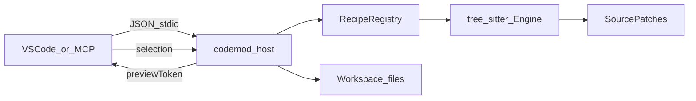

# Architecture

codemod_recipe applies deterministic file changes from declarative YAML recipes. The
runtime is implemented in Rust; agents and the VS Code extension talk to the same
host protocol.

## Components

| Component | Location | Role |
|-----------|----------|------|
| YAML model + validation | `rust/crates/yaml/` | Parse recipes, validate steps, compose `recipe:` refs |
| Tree-sitter engine | `rust/crates/engine/` | Query evaluation, insert/replace/remove |
| Core types | `rust/crates/core/` | Patches, file changes, atomic apply |
| Host + MCP | `rust/crates/host/` | Registry, preview/apply/diff, bootstrap, `codemod_mcp` |
| VS Code extension | `vscode_extension/` | UI, spawns bundled `codemod_host` |
| Shipped recipes | `.codemod/recipes/` | Example YAML for this repo |

## Data flow

```mermaid
flowchart LR
  UI[VSCode_or_MCP] -->|JSON_stdio| Host[codemod_host]
  Host --> Registry[RecipeRegistry]
  Registry --> Engine[tree_sitter_Engine]
  Engine --> Patches[SourcePatches]
  Host -->|previewToken| UI
  UI -->|selection| Host
  Host --> FS[Workspace_files]
```

## Design principles

1. **Determinism** — Same recipe + args + file contents produce the same patches.
2. **Preview before apply** — Host returns a `previewToken`; apply requires it and optional per-patch selection.
3. **Tree-sitter queries** — Edits target AST nodes via captures; no analyzer-specific navigate DSL.
4. **Multi-language** — `language:` on edit steps (or extension inference) selects grammars from the language registry.

## Recipes

Recipes require `id` and `steps`. Step types: `edit`, `create`, `delete`, `recipe` (composition).
Templates use MiniJinja; maps and variables resolve through the host registry.

See agent skill `codemod-yaml-dsl` and `docs/recipe-templates.md` for syntax.

## Testing

- Unit and integration tests: `rust/` (`cargo test --all`).
- Golden Dart fixtures: `test/fixtures/rust_oracle/`, `test/fixtures/ast_paths/`.
- Scaffold and jinja showcase: `test/fixtures/scaffold_project/`, `test/fixtures/jinja_examples/`.

## Extension

The extension bundles `codemod_host` from `vscode_extension/build.sh`. Message types are
shared in `vscode_extension/src/shared/messages.ts`; the host protocol is implemented in
`rust/crates/host/src/dispatch.rs` and `protocol.rs`.
