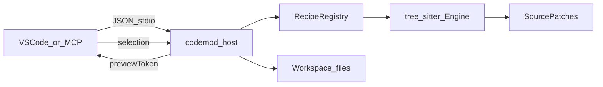

# Getting Started with Codemod Recipe

A human-oriented walkthrough of the product: what it is, how the pieces fit
together, and how to run your first recipe. Deep reference stays in the linked
topic docs — this guide is the map and the day-1 path.

For a full documentation index, see [README.md](README.md) in this folder.

## What you’re getting

**codemod-recipe** applies deterministic, AST-safe edits from declarative YAML
recipes. Edits target tree-sitter nodes (insert / replace / remove), so the same
recipe + args + file contents produce the same patches every time.

Everything runs through a **Rust host** (`codemod_host`). Two clients talk to it:

| Client | Best for |
|--------|----------|
| **VS Code / Codium extension** | Interactive preview, selective patches, exploring recipes |
| **MCP server** (`codemod_mcp`) | Agents (Cursor, etc.) calling validate → preview → apply |



The golden rule: **preview before apply**. The host returns a `previewToken`;
apply requires that token (and may include a patch selection).

Languages: Dart is the default. Rust, Java, Kotlin, SQL/SQLite, and 300+ grammars
are available via tree-sitter — set `language:` on edit steps for non-Dart files.

## Where documentation lives

Three layers exist on purpose. Humans and agents use different ones.

| Layer | Location | Audience |
|-------|----------|----------|
| **Human docs** | `docs/`, root and extension READMEs | You — tutorials and reference |
| **Agent skills** | `.agents/skills/` after bootstrap; source of truth `export/.agents/skills/` | Cursor / MCP agents |
| **Rules** | `.cursor/rules/` | Always-on agent policy — not a human manual |

Human docs in this repository are **not** copied by `bootstrap_project`. Agent
skills and rules are. See the [docs index](README.md) for every topic page.

## Pick a path

Both paths share the same engine and YAML format. Choose by how you want to work:

- **VS Code (recommended for learning)** — browse recipes, fill a form, review
  diffs, apply selected patches. Full setup:
  [vscode_extension/README.md](../vscode_extension/README.md).
- **MCP (recommended for agents)** — bootstrap skills, then validate / preview /
  apply from the agent. Path-specific guide:
  [new-project-rust-mcp.md](new-project-rust-mcp.md). Tool reference:
  [codemod-mcp.md](codemod-mcp.md).

You can use both against the same `.codemod/` directory.

## Setup (enough to succeed)

### Prerequisites

- A target workspace (the project you want to edit).
- [Rust](https://rustup.rs/) (stable) if you build the host or MCP from source.
- [Node.js](https://nodejs.org/) 18+ to build the VS Code extension.

### Workspace layout

In the target project:

```text
.codemod/
  recipes/     # recommended for recipes (*.yaml with steps)
  maps/        # recommended for maps (id + map:)
  variables/   # recommended for variables (id + values:)
  templates/   # optional (create.templateFile)
```

Discovery is **schema-based** under `.codemod/` — directory names are convention.
Any YAML with `steps:` is a recipe; maps need `id` + `map:`; variables need
`id` + `values:`.

File-backed resources (`.scm` queries, `templateFile`, `postExecution`, template
`extends` / `include`) resolve recipe-local first, then under `.codemod/`.

### VS Code extension

1. From this repo: `cd vscode_extension && ./build.sh` (bundles `codemod_host`).
2. Install the VSIX and open a workspace that has (or will have) `.codemod/`.
3. Use **Codemod Recipe: Scaffold Project** if `.codemod` is missing.
4. Open the **Codemod Recipe** activity bar: Recipes + Recipe Runner.

Details and settings: [vscode_extension/README.md](../vscode_extension/README.md).

### MCP

1. Build/run `codemod_mcp` pointing at your workspace root and `.codemod`.
2. Configure Cursor (or another MCP client) — see [codemod-mcp.md](codemod-mcp.md).
3. Call `bootstrap_project` once to install agent skills/rules and scaffolding.
4. End-to-end new-project checklist:
   [new-project-rust-mcp.md](new-project-rust-mcp.md).

## Core concepts

### Recipes

A recipe is YAML with at least `id` and `steps`. Optional `args` declare
parameters (file paths, symbols, booleans, …). Steps can be:

| Step | Role |
|------|------|
| `edit` | AST insert / replace / remove in an existing file |
| `create` | New file from inline `template` or `templateFile` |
| `delete` | Remove a file (`ifMissing: fail \| skip`) |
| `recipe` | Compose another recipe by id |
| `if` | Conditional group of steps |

```yaml
id: add_log_line
args:
  - name: file
    required: true
    inputKind: file
  - name: className
    required: true
    inputKind: symbol
  - name: methodName
    required: true
    inputKind: symbol
steps:
  - edit:
      path: "{{file}}"
      ops:
        - insert:
            query: |
              (class_definition
                name: (identifier) @className
                body: (class_body
                  (method_signature
                    (function_signature
                      name: (identifier) @methodName))
                  (function_body
                    (block) @body))
                (#eq? @className "{{className}}")
                (#eq? @methodName "{{methodName}}"))
            capture: body
            anchor: end
            text: "    print('codemod');\n"
```

Optional `postExecution` runs shell commands after a successful apply (for example
`dart format .`).

### Tree-sitter queries

Ops find nodes with tree-sitter query S-expressions. You name captures
(`@body`), optionally filter with predicates (`#eq?`), and point the op at a
`capture`. Queries can be inline or a path to a `.scm` file.

Full guide: [tree-sitter-queries.md](tree-sitter-queries.md).

### Edit ops

Under `edit.ops`:

| Op | Needs | Notes |
|----|-------|-------|
| `insert` | `query`, `capture`, `anchor` (`start` \| `end`), `text` | Insert at capture boundary |
| `replace` | `query`, `capture`, `text` | Replace the captured node |
| `remove` | `query`, `capture` | Delete the captured node |

Guards (`when` / `whenNot`) and `let` bindings can scope or bind locals for later
ops. Prefer idempotent recipes: a second apply should produce no patches.

### Templates (Jinja / MiniJinja)

String fields in recipes are rendered with
[MiniJinja](https://docs.rs/minijinja/) (Jinja2-compatible):

```jinja
{{ file }}
{{ feature | snake_case }}
{{ featureDir | parent | basename }}
…
```

File-backed creates use `create.templateFile` and may `extends` / `include` other
templates. Maps and shared variables appear as `{{ map.id.key }}` and
`{{ var.id.key }}` (also `{{ key | map('id') }}`).

Full guide: [recipe-templates.md](recipe-templates.md). Showcase recipes:
[`test/fixtures/jinja_examples/`](../test/fixtures/jinja_examples/).

### Maps and variables

- **Maps** — YAML with `id` + `map:` (lookup tables for templates).
- **Variables** — YAML with `id` + `values:` (shared constants).

Put them under `.codemod/maps/` and `.codemod/variables/` by convention; the host
discovers them by schema anywhere under `.codemod/`.

### Composition

Reference other recipes by id:

```yaml
steps:
  - recipe: dart.settings.add_counter_field
  - recipe: dart.logging.add_log_line
```

Referenced edit steps are inlined; args are merged (first definition wins). Prefer
a parent `postExecution` for formatting. You can also pass a full recipe object as
`inlineRecipe` to the host/MCP with no file on disk.

### Languages

Default language is Dart. For other files, set `language:` on the `edit` step and
write queries for that grammar’s node names. `.sql` defaults to `sqlite`.

Details: [language-support.md](language-support.md).

### Naming and design patterns

Organize by feature, and name by intent:

| Prefix | Purpose |
|--------|---------|
| `create_` | Greenfield files from templates |
| `add_` / `patch_` | Brownfield AST edits (one change each) |
| `scaffold_` | Feature workflow (compose atomics) |
| `remove_` | Tear down members or files |

**One recipe = one coherent change.** Compose upward with scaffolds.
Summary: [recipe-design-patterns.md](recipe-design-patterns.md).

## Day-1 success: run a recipe

### In VS Code

1. Open **Codemod Recipe** → pick a recipe in the **Recipes** tab.
2. Fill args in **Recipe Runner** (live preview updates as you type).
3. Review files/patches; uncheck anything you do not want.
4. **Apply Selected**.

Power features (keyboard slots, `from:` arg derivation from the editor, explorer
context menu): [recipe-shortcuts.md](recipe-shortcuts.md).

### Over MCP

Typical tool order:

1. `bootstrap_project` (once, if needed)
2. `validate_recipes` (after editing YAML)
3. `list_recipes` / `describe_recipe`
4. `preview_recipe` — save `previewToken`
5. `apply_recipe` with the same recipe/args + token

Re-preview the same recipe afterward: an idempotent recipe returns no files.
More detail: [codemod-mcp.md](codemod-mcp.md).

## Optional companion: codebase-memory

For large codebases, [codebase-memory-mcp](https://github.com/DeusData/codebase-memory-mcp)
helps locate symbols and impact **before** you write or choose a recipe. It is
independent of codemod-recipe. Bootstrap can install a companion Cursor rule via
`companions: ["codebase-memory"]` when that MCP is configured.

## What agents use (you don’t need to memorize)

After `bootstrap_project`, agents get modular skills under `.agents/skills/`
(`codemod-yaml-dsl`, `codemod-mcp-playbook`, and others) plus an always-on rule.
Those teach agents the same concepts this guide teaches humans. Prefer this guide
and the topic docs when learning yourself; let agents load skills.

## Next steps

| Goal | Go to |
|------|-------|
| Docs map (everything) | [docs/README.md](README.md) |
| Extension UI & settings | [vscode_extension/README.md](../vscode_extension/README.md) |
| New project + MCP | [new-project-rust-mcp.md](new-project-rust-mcp.md) |
| Jinja / templates | [recipe-templates.md](recipe-templates.md) |
| Queries | [tree-sitter-queries.md](tree-sitter-queries.md) |
| Multi-language | [language-support.md](language-support.md) |
| Shortcuts / slots | [recipe-shortcuts.md](recipe-shortcuts.md) |
| Architecture | [ARCHITECTURE.md](../ARCHITECTURE.md) |
| Contributing | [CONTRIBUTING.md](../CONTRIBUTING.md) |
