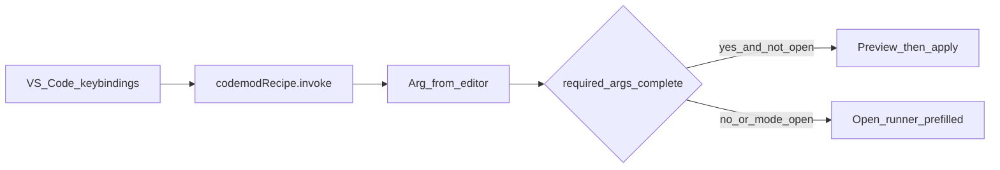

# Recipe shortcuts (VS Code)

Keyboard shortcuts that derive recipe args from the active editor, then either
**apply** the recipe or **open** the Recipe Runner prefilled.

Physical keys stay in VS Code’s Keyboard Shortcuts UI. Recipes declare **how** to
fill args (`from` / `contextKey`). Invocation picks **which** recipe and **mode**.



## Quick start

1. Declare `from` on recipe args so required fields resolve from the open file / cursor.
2. Map a slot (or bind `codemodRecipe.invoke` directly).
3. Press the chord — complete args apply; incomplete ones open the runner.

### Workspace slots

```jsonc
// .vscode/settings.json
{
  "codemodRecipe.slots": {
    "1": "flutter.add_cubit",
    "b": "flutter.add_bloc",
    "c": "flutter.add_cubit"
  }
}
```

Slot ids are **any character key** VS Code can use as a chord second stroke
(`1`, `b`, `[`, …) — not only digits.

Default sample chords (when the extension is installed):

| Chord | Command | Mode |
|-------|---------|------|
| `Ctrl+Shift+I` then `1` | `codemodRecipe.invokeSlot` | `auto` |
| `Ctrl+Shift+T` then `1` | `codemodRecipe.invokeSlot` | `open` |

Add letter chords yourself in Keyboard Shortcuts, for example:

```json
{
  "key": "ctrl+shift+i b",
  "command": "codemodRecipe.invokeSlot",
  "args": { "slot": "b", "mode": "auto" }
}
```

Mac uses `cmd` instead of `ctrl` in the shipped defaults.

### Authoring helpers

On a recipe YAML `id:` line (CodeLens):

- **Copy invoke keybinding** — clipboard JSON for `codemodRecipe.invoke`
- **Assign to slot…** — writes `codemodRecipe.slots` and optionally copies a slot keybinding

Commands also appear in the Command Palette:
`Codemod Recipe: Copy Invoke Keybinding`, `Assign to Slot`, `Copy Slot Keybinding`.

## Invocation modes

Commands:

- `codemodRecipe.invoke` — `{ "recipeId": "…", "mode": "auto"|"run"|"open", "args"?: { … } }`
- `codemodRecipe.invokeSlot` — `{ "slot": "b", "mode": "…", "args"?: { … } }`

| Mode | Behavior |
|------|----------|
| `auto` (default) | All required args filled (after derivation + `defaultsTo`) → preview then apply; else open runner prefilled |
| `run` | Same completeness check; if incomplete, show a warning and still open the runner |
| `open` | Always open the runner prefilled |

Optional `args` in the keybinding override derived values (binding wins).

**Execute** means: host preview → apply all non-skipped changes → toast with file count.
On preview/apply failure, the runner opens with the derived args (never silent fail).

Setting `codemodRecipe.shortcutConfirmApply` (default `false`) asks before auto-apply.

Discovery without a fixed recipe: **Codemod Recipe: Run From Cursor Context**
(`Ctrl+Alt+R`) QuickPicks recipes that match any derived arg, then uses `auto` mode.

## Deriving args (`from`)

Put derivation on the **recipe**, not in keybindings. Every entry point (shortcut,
CodeLens, context menu) shares the same rules.

### Builtin keys (string form)

```yaml
args:
  - name: file
    required: true
    from: file
  - name: className
    from: word
```

`contextKey` is a deprecated alias of string `from`.

| Builtin | Meaning |
|---------|---------|
| `file` | Workspace-relative path (or absolute if outside root) |
| `fileBasename` | Filename with extension |
| `fileDirname` | Directory of `file` |
| `fileStem` | Filename without extension |
| `fileExt` | Extension without leading `.` |
| `selection` | Selected text |
| `word` | Word at cursor |
| `line` | Full text of the active line |
| `lineNumber` | 1-based line number (string) |
| `languageId` | VS Code language id |

### Path / template form

Evaluated against the builtin map (simple `{{ name }}` / `{{ name \| filter }}` in
the extension; host `deriveArgs` uses full MiniJinja when query forms are involved):

```yaml
- name: feature
  from:
    template: "{{ fileDirname | basename }}"
```

Filters available in the extension shortcut path: `basename`, `dirname`, `stem`.

### Tree-sitter form (like `let`)

```yaml
- name: className
  required: true
  from:
    query: |
      (class_definition
        name: (identifier) @name)
    capture: name
    extract: text          # text | kind | exists | count
    scope: enclosing       # enclosing | selection | first (default: enclosing)
    language: dart         # optional; else editor language / file extension
    as: "{{ className }}"  # optional post-template
    onNoMatch: omit        # omit | empty — omit leaves arg unset → runner
```

| `scope` | Match selection |
|---------|-----------------|
| `enclosing` | Captures whose range contains the cursor; tightest wins |
| `selection` | Captures intersecting the selection |
| `first` | First match in the file |

Query evaluation runs in the Rust host (`deriveArgs`). If the host is down or the
query fails, that arg is left unset (partial → open runner).

## Completeness rule

After merging derived values, keybinding overrides, and `defaultsTo`, any
**required** arg that is still empty opens the runner instead of applying
(`auto` / `run`). Optional args never block execute.

## Related

- [vscode_extension/README.md](../vscode_extension/README.md) — extension setup
- [docs/recipe-templates.md](recipe-templates.md) — MiniJinja in recipe steps
- [docs/tree-sitter-queries.md](tree-sitter-queries.md) — query language
- Agent skill `codemod-yaml-dsl` — YAML `args` / `from` reference
