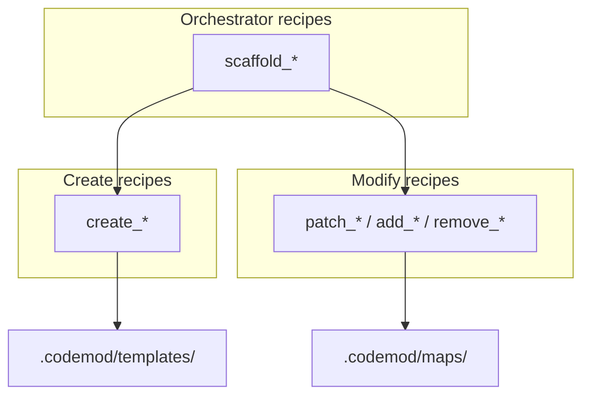

# Recipe Design Patterns (Create vs Modify)

Organize codemod-recipe YAML v2 recipes around **concepts or features**, with a clear
split between **creation** (greenfield scaffolding) and **modification** (brownfield AST
edits).

## Mental model

Think in three layers:

1. **Atomic recipes** — one coherent change (create one file, add one field, remove one member).
2. **Orchestrator recipes** — compose atomics into a feature-level workflow.
3. **Shared assets** — templates and maps reused across recipes.



**One recipe = one coherent change**, composed upward for features. For YAML syntax see
skill `codemod-yaml-dsl-v2`.

## Recipe taxonomy

Convey recipe kind through the `id` prefix and `description` — there is no separate
`kind` field in the schema.

| Prefix | Purpose | Primary step types | Typical idempotency |
|--------|---------|-------------------|---------------------|
| `create_` | Generate new files from templates | `create` | Fail if file exists (`ifExists: fail`) |
| `add_` / `patch_` | Insert or update existing code | `edit` (insert/replace) | Varies (see Idempotency) |
| `remove_` | Tear down code or files | `edit` (remove) or `delete` | Safe to re-run when target is gone |
| `scaffold_` | Feature-level workflow | `recipe:` composition (+ optional `delete`) | Depends on child recipes |

### `create_<artifact>` — greenfield files

Generate new source when nothing exists yet.

- Use `create` steps with `template` or `templateFile`.
- Default `ifExists: fail` prevents accidental overwrites.
- Args drive paths and class names (`feature`, `className`).

```yaml
steps:
  - create:
      path: "lib/counter/counter_repository.dart"
      templateFile: templates/counter_repository.dart.template
      ifExists: fail
```

### `add_<thing>_to_<target>` / `patch_<target>` — brownfield edits

Insert, replace, or remove AST nodes in existing files.

- Use `edit` steps with tree-sitter `query` + `capture`.
- Keep each recipe **atomic**: "add field to state class" is one recipe; "add matching
  handler to bloc" is a separate recipe (or a thin orchestrator that calls both).
- Args: `file` (or convention-derived path), `className`, domain symbols (`fieldName`,
  `eventName`).

### `scaffold_<feature>` — feature-level orchestrator

Run a "new feature" workflow end-to-end: create files, wire into existing code, optional
cleanup.

- Steps are `- recipe: <id>` references (plus optional `delete`).
- Args are the union of child recipe args; pass through to composed recipes.

```yaml
steps:
  - recipe: create_repository
  - recipe: patch_counter
  - recipe: patch_app
  - delete:
      path: "lib/legacy/stale.dart"
      ifMissing: skip
```

### `remove_<thing>_from_<target>` — teardown

Symmetric counterpart to `add_*`.

- Use `remove` ops for AST members, or `delete` steps for whole files.
- Prefer `ifMissing: skip` on file deletes.
- `remove` queries that match nothing produce an empty preview (safe re-run).

## Directory layout

Group recipes by **concept** (bloc, repository, routing), not by file type. Adopt
incrementally — flat `recipes/` is fine for small projects.

```text
.codemod/
  recipes/
    bloc/
      scaffold_bloc_feature.yaml    # orchestrator
      create_bloc.yaml
      create_bloc_state.yaml
      add_bloc_state_field.yaml
      add_bloc_event_handler.yaml
    shared/
      add_class_field.yaml          # cross-cutting atomic edits
  maps/
    dart_types.yaml                 # fieldName -> Dart type
    bloc_event_kinds.yaml
  templates/
    bloc/
      bloc.dart.template
      bloc_state.dart.template
      bloc_event.dart.template
```

### Naming rules

- Recipe `id` is the stable API (`list_recipes` / `describe_recipe`). Use `snake_case`.
- Prefix encodes kind: `create_`, `add_`, `patch_`, `remove_`, `scaffold_`.
- Maps are keyed by **allowed symbolic names** (not free-form strings).

Example workspace map (`.codemod/maps/field_kind.yaml`):

```yaml
id: field_kind
entries:
  tickCount: int
  label: String
```

## Composition pattern

Prefer small, reusable atomics composed by orchestrators:

```yaml
# scaffold_bloc_feature.yaml (orchestrator)
steps:
  - recipe: create_bloc_state
  - recipe: create_bloc_event
  - recipe: create_bloc
  - recipe: patch_app_routes
```

Referenced recipe steps are inlined in order. Args merge by name (first definition wins).
Recipe cycles are rejected.

For incremental changes after scaffolding, call atomic `add_*` recipes directly — do not
re-run the orchestrator.

## Maps and templates

**Templates** (`create.templateFile`) hold greenfield file skeletons. Use `{{arg}}` and
casing helpers (`{{$pascal feature}}`, `{{$snake feature}}`). See skill `codemod-yaml-dsl-v2`.

**Maps** resolve symbolic names to types or snippets:

```yaml
# .codemod/maps/dart_types.yaml
id: dart_types
entries:
  email: String
  age: int
```

```yaml
# In a recipe
text: "  final {{$map 'dart_types' fieldName}} {{$camel fieldName}};\n\n"
```

Recipe-local `maps:` and workspace `.codemod/maps/*.yaml` both work and merge.

## Args conventions

Use a consistent vocabulary across related recipes:

| Arg | `inputKind` | Used by |
|-----|-------------|---------|
| `file` | `file` | Generic edit recipes |
| `feature` | `symbol` | Scaffold orchestrators (drives paths via `{{$snake feature}}`) |
| `className` | `symbol` | Class-targeted edits |
| `fieldName` / `eventName` | `symbol` | Domain symbols; type resolved via map |
| `fieldType` | optional or map-backed | When not inferable from map |

**Path convention:** pick one style per project and stick to it.

- Scaffolds derive paths from args: `lib/features/{{$snake feature}}/{{$snake feature}}_state.dart`
- Modify recipes take explicit `file`, or use the same path template as scaffolds

## Example: Flutter Bloc feature

Illustrative sketches — not shipped recipes.

| User intent | Recipe kind | What it does |
|-------------|-------------|--------------|
| New Bloc feature | `scaffold_bloc_feature` | Compose `create_bloc`, `create_bloc_state`, `create_bloc_event`, `patch_app_routes` |
| Add state field | `add_bloc_state_field` | Insert field in state class; update `copyWith` / `props` |
| Add event handler | `add_bloc_event_handler` | Insert `on<Event>` handler in bloc class |
| Add event type | `add_bloc_event` | Insert sealed class variant in event file |

Orchestrator sketch:

```yaml
dslVersion: 2
id: scaffold_bloc_feature
description: Scaffold a new Bloc feature (state, event, bloc files + app wiring)

args:
  - name: feature
    required: true
    inputKind: symbol

steps:
  - recipe: create_bloc_state
  - recipe: create_bloc_event
  - recipe: create_bloc
  - recipe: patch_app_routes
```

Atomic modify sketch (state field):

```yaml
dslVersion: 2
id: add_bloc_state_field
description: Add a typed field to an existing Bloc state class

args:
  - name: feature
    required: true
    inputKind: symbol
  - name: fieldName
    required: true
    inputKind: symbol

maps:
  dart_types:
    email: String
    count: int

steps:
  - edit:
      path: "lib/features/{{$snake feature}}/{{$snake feature}}_state.dart"
      ops:
        - insert:
            query: |
              (class_definition
                name: (identifier) @className
                body: (class_body) @body
                (#eq? @className "{{$pascal feature}}State"))
            capture: body
            anchor: start
            text: "  final {{$map 'dart_types' fieldName}} {{$camel fieldName}};\n\n"
```

**Agent workflow:**

1. `describe_recipe` on `scaffold_bloc_feature` for new features.
2. After scaffolding, use atomic `add_*` recipes for incremental changes.
3. Never guess AST paths — use tree-sitter queries with explicit captures.

## Example: Database tables (conceptual)

codemod-recipe today is **Dart AST–scoped** (tree-sitter Dart queries). The same taxonomy
applies to database work when schema lives in Dart (Drift, Floor, Isar).

| User intent | Recipe kind | Notes |
|-------------|-------------|-------|
| New table | `create_table_users` or `scaffold_drift_table` | `create` step with table template |
| Add column | `add_column_users_email` | `edit` step targeting Dart table definition |
| Remove column | `remove_column_users_email` | `remove` op on field member |

For **raw SQL migrations**, use the same naming but note that YAML v2 `edit` ops do not
apply to `.sql` files today.

## Idempotency

Agents should always: `preview_recipe` → `apply_recipe` → re-preview.

| Kind | Expected behavior | How |
|------|-------------------|-----|
| `create_*` | Fail if exists | `ifExists: fail` (default) |
| `add_*` (insert) | Often **not** idempotent | Design query to match only when target is absent, or accept preview failure on re-run |
| `replace_*` | Idempotent | `replace` op with final desired text |
| `remove_*` | Idempotent | `remove` when gone → empty preview |

YAML v2 has no built-in "skip if exists" for inserts. Plan for non-idempotent `add_*`
recipes and document that in the recipe `description`.

After apply, re-run `preview_recipe` — expect `files: []` for idempotent recipes.

## Related skills

- `codemod-yaml-dsl-v2` — YAML syntax, templates, maps
- `codemod-recipe-authoring` — tree-sitter queries
- `codemod-mcp-playbook` — preview/apply workflow
