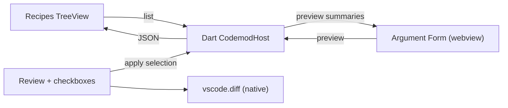

# Codemod Recipe — VS Code Extension

A GUI for the [`codemod_recipe`](../README.md) toolkit. Browse recipes, fill in
placeholder values through a form, preview changes as a native diff, and choose
exactly which edits to keep before applying.

## How it works

The extension does not parse Dart. Instead it launches a small Dart **host**
entry point you provide, and talks to it over a JSON-over-stdio protocol.



The host wraps your recipes with `CodemodHost`. The extension keeps a persistent
host process (`--stdio-server`) and sends one JSON command per stdin line,
reading responses wrapped in `__CODEMOD_RESULT_BEGIN__` /
`__CODEMOD_RESULT_END__` markers (so post-execution output such as `dart format`
never corrupts the response). If the persistent host fails, the extension falls
back to one-shot request mode.

## Setup

### 1. Create a host entry point

In your project, add a Dart file that registers the recipes you want to expose:

```dart
// tool/codemod_host.dart
import 'package:codemod_recipe/codemod_recipe_vscode.dart';
import 'recipes.dart';

Future<void> main(List<String> args) {
  return CodemodHost.fromList([
    addMethodRecipe,
    scaffoldFeatureRecipe,
  ]).run(args);
}
```

A complete working example lives in
[`example/vscode_host_example`](../example/vscode_host_example).

### 2. Point the extension at it

The extension auto-detects `tool/codemod_host.dart`, `tool/codemods/codemod_host.dart`,
or `bin/codemod_host.dart`. To use a different path, set:

```jsonc
// .vscode/settings.json
{
  "codemodRecipe.hostEntrypoint": "tool/codemod_host.dart",
  "codemodRecipe.dartPath": "dart", // or an absolute path / fvm wrapper
  "codemodRecipe.performanceLogging": false, // log list/preview/apply timings
  "codemodRecipe.autoPreviewDebounceMs": 400, // debounce for live preview
  "codemodRecipe.previewSnippetLines": 5 // max lines shown in review snippets
}
```

You can also run **Codemod Recipe: Set Host Entry Point** from the command palette.

## Usage

1. Open the **Codemod Recipe** view in the activity bar. The side view has
   **Recipes** and **Recipe Runner** tabs.
2. Click a recipe in the **Recipes** tab to switch to the runner tab and open the
   argument form. Required fields are marked with `*`; file and directory args
   get picker buttons; enum-like args can use editable suggestions.
3. The **Recipe Runner** tab shows parameter metadata and runs live preview
   automatically as form values change.
4. The review panel shows changed files with short snippets and per-file/per-patch
   selection controls.
5. Use **Previous Change**, **Next Change**, or click a patch row to step through
   changes and open the native side-by-side diff for that file.
6. Uncheck any files or patches you do not want, then click **Apply Selected**.
   Only the selected patches are written, and recipe post-execution (e.g.
   formatting) runs afterwards.

You can also run **Codemod Recipe: Run From Cursor Context** (`Cmd+Alt+R` on
macOS, `Ctrl+Alt+R` elsewhere). Recipes whose args declare context keys are
shown in a picker and opened with values derived from the active editor.
Recipe metadata is cached in-memory and refreshed automatically on startup,
manual refresh, and staleness checks.

## Recipe UI metadata

Recipes can provide optional argument metadata to improve the extension UX:

```dart
final addMethodRecipe = CodemodRecipe(
  name: 'add_method',
  args: [
    CodemodArg.required(
      'file',
      inputKind: CodemodArgInputKind.file,
      contextKey: CodemodContextKey.file,
    ),
    CodemodArg.required(
      'class',
      inputKind: CodemodArgInputKind.symbol,
      contextKey: CodemodContextKey.dartClass,
    ),
    CodemodArg.required(
      'method',
      inputKind: CodemodArgInputKind.symbol,
      options: ['reset', 'dispose'],
      allowCustomValue: true,
      contextKey: CodemodContextKey.word,
    ),
  ],
  operations: [
    // ...
  ],
);
```

For many independent recipes, keep each recipe in its own Dart file, export a
single `allRecipes` list from a small registry file, and launch the extension
host with `CodemodHost.fromList(allRecipes)`.

## Protocol reference

Commands accepted by the host (one JSON object per process on stdin):

```jsonc
{ "command": "list" }

{ "command": "preview", "recipe": "add_method",
  "args": { "file": "lib/foo.dart", "class": "Foo", "method": "bar" },
  "snippetLines": 5 }

{ "command": "diff", "recipe": "add_method", "path": "lib/foo.dart",
  "args": { "file": "lib/foo.dart", "class": "Foo", "method": "bar" } }

{ "command": "apply", "recipe": "add_method",
  "args": { "file": "lib/foo.dart", "class": "Foo", "method": "bar" },
  "selection": { "files": { "lib/foo.dart": { "include": true, "patches": [0] } } } }
```

Omitting a file from `selection.files` keeps all of its patches. Setting
`include: false` (or an empty `patches` list) drops the file.

## Development

```bash
cd vscode_extension
npm install
npm run compile          # build Vue webview + type-check extension to dist/
npm run watch            # rebuild extension host on change
npm run watch:webview    # rebuild webview UI (media/recipeView.js) on change
npm run test:webview     # unit tests for webview arg/selection helpers
```

The sidebar UI lives in [`src/webview/`](src/webview/) (Vue 3 + Vite) and compiles
into [`media/recipeView.js`](media/recipeView.js) and [`media/recipeView.css`](media/recipeView.css).
Shared message types and constants used by both the extension host and webview are in
[`src/shared/`](src/shared/). Run `npm run build:webview` (or full `npm run compile`) before `F5`
if you change webview sources. Pressing **F5** with the `vscode_extension` folder open runs the
`npm: compile` pre-launch task automatically (see [`.vscode/launch.json`](.vscode/launch.json)).

The files in `media/` (`recipeView.html`, `recipeView.js`, `recipeView.css`) are
**built artifacts**: edit sources under `src/webview/`, then compile. They are loaded
as static extension resources at runtime (not generated when you open the view).

```bash
# Integration smoke test against the example host:
node scripts/smoke.mjs "$(cd ../example/vscode_host_example/bin && pwd)/codemod_host.dart"
```

Press `F5` in VS Code (with this folder open) to launch an Extension
Development Host for manual testing.

### Manual smoke checklist (webview)

1. Open **Codemod Recipe** — **Recipes** tab lists recipes from the host.
2. Select a recipe — **Recipe Runner** tab opens with the argument form.
3. Edit args — preview status updates; review panel appears when the host returns files.
4. **Previous Change** / **Next Change** — active patch highlights; native diff opens.
5. Toggle file/patch checkboxes — **Apply Selected** enables when preview is current.
6. **Browse…** on file/directory args — path fills in and preview re-runs.
7. Switch tabs — form values and review state persist (no full page reload).
