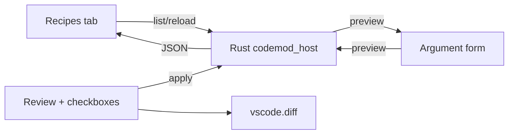

# Codemod Recipe — VS Code Extension

A GUI for the [`codemod_recipe`](../README.md) toolkit. Browse recipes, fill in
placeholder values through a form, preview changes as a native diff, and choose
exactly which edits to keep before applying.

## How it works

The extension does not parse source files itself. It launches the **Rust
`codemod_host`** binary (tree-sitter engine) and talks to it over a
JSON-over-stdio protocol.


```mermaid
flowchart LR
    RecipesTab["Recipes tab"] -->|list/reload| Host
    Form["Argument form"] -->|preview| Host
    Review["Review + checkboxes"] -->|apply| Host
    Host["Rust codemod_host"] -->|JSON| RecipesTab
    Host -->|preview| Form
    Review --> Diff["vscode.diff"]
```

**Default:** bundled `codemod_host` from `vscode_extension/bin/` (built via
`build.sh` from `rust/`). **Dev fallback:** `cargo run -p codemod_recipe_host
--bin codemod_host` when no binary is present.

## Setup

### YAML recipes

1. Create a `.codemod/` directory in your workspace root.
2. Add YAML recipe files (`.yaml` or `.yml`) under `.codemod/recipes/` (or
   configure another layout under the codemod root). Each recipe must have an
   `id:` and `steps:` field (`dslVersion: 2`).
3. Optionally add maps under `.codemod/maps/` and templates under
   `.codemod/templates/`.
4. Build and install the extension from `vscode_extension/` (`./build.sh`, or
   `npm run compile` then package/install the VSIX).
5. Open your project in VS Code and configure settings if needed:

```jsonc
// .vscode/settings.json
{
  "codemodRecipe.codemodRoot": ".codemod",
  "codemodRecipe.autoPreviewDebounceMs": 400,
  "codemodRecipe.previewSnippetLines": 5
}
```

All YAML and `.template` files in the codemod root are automatically discovered
and reloaded when changed; recipe load errors (e.g. duplicate ids) appear in the
Recipes tab.

### Custom codemod root

To use a different directory than `.codemod`, set `codemodRecipe.codemodRoot` in
settings or use **Codemod Recipe: Set Codemod Root Directory**.

## Usage

1. Open the **Codemod Recipe** view in the activity bar. The side view has
   **Recipes** and **Recipe Runner** tabs.
2. Click a recipe in the **Recipes** tab to switch to the runner tab and open the
   argument form. Required fields are marked with `*`; file and directory args
   get picker buttons; enum-like args can use editable suggestions.
3. The **Recipe Runner** tab shows parameter metadata and runs live preview
   automatically as form values change.
4. The review panel shows changed files with short snippets and per-file/per-patch
   selection controls.
5. Use **Previous Change**, **Next Change**, or click a patch row to step through
   changes and open the native side-by-side diff for that file.
6. Uncheck any files or patches you do not want, then click **Apply Selected**.
   Only the selected patches are written, and recipe post-execution (e.g.
   formatting) runs afterwards.

You can also run **Codemod Recipe: Run From Cursor Context** (`Cmd+Alt+R` on
macOS, `Ctrl+Alt+R` elsewhere). Recipes whose args declare context keys are
shown in a picker and opened with values derived from the active editor.

## Protocol reference

Commands accepted by the host (one JSON object per line on stdin):

```jsonc
{ "command": "list" }

{ "command": "validate" }

{ "command": "preview", "recipe": "add_log_line",
  "args": { "file": "lib/foo.dart", "className": "Foo", "methodName": "bar" },
  "snippetLines": 5 }

{ "command": "diff", "recipe": "add_log_line", "path": "lib/foo.dart",
  "args": { "file": "lib/foo.dart", "className": "Foo", "methodName": "bar" } }

{ "command": "apply", "recipe": "add_log_line",
  "args": { "file": "lib/foo.dart", "className": "Foo", "methodName": "bar" },
  "previewToken": "<from preview>",
  "selection": { "files": { "lib/foo.dart": { "include": true, "patches": [0] } } } }
```

Omitting a file from `selection.files` keeps all of its patches. Setting
`include: false` (or an empty `patches` list) drops the file.

## Development

```bash
cd vscode_extension
npm install
npm run compile          # build Vue webview + type-check extension to dist/
npm run watch            # rebuild extension host on change
npm run watch:webview    # rebuild webview UI (media/recipeView.js) on change
npm run test:webview     # unit tests for webview arg/selection helpers
./build.sh               # release Rust host + package VSIX
```

The sidebar UI lives in [`src/webview/`](src/webview/) (Vue 3 + Vite) and compiles
into [`media/recipeView.js`](media/recipeView.js) and [`media/recipeView.css`](media/recipeView.css).
Shared message types and constants used by both the extension host and webview are in
[`src/shared/`](src/shared/). Run `npm run build:webview` (or full `npm run compile`) before `F5`
if you change webview sources.

The files in `media/` (`recipeView.html`, `recipeView.js`, `recipeView.css`) are
**built artifacts**: edit sources under `src/webview/`, then compile.

```bash
# Integration smoke test against the Rust host (requires cargo):
node scripts/smoke.mjs
```

Press `F5` in VS Code (with this folder open) to launch an Extension
Development Host for manual testing.

### Manual smoke checklist (webview)

1. Open **Codemod Recipe** — **Recipes** tab lists recipes from the host.
2. Select a recipe — **Recipe Runner** tab opens with the argument form.
3. Edit args — preview status updates; review panel appears when the host returns files.
4. **Previous Change** / **Next Change** — active patch highlights; native diff opens.
5. Toggle file/patch checkboxes — **Apply Selected** enables when preview is current.
6. **Browse…** on file/directory args — path fills in and preview re-runs.
7. Switch tabs — form values and review state persist (no full page reload).
