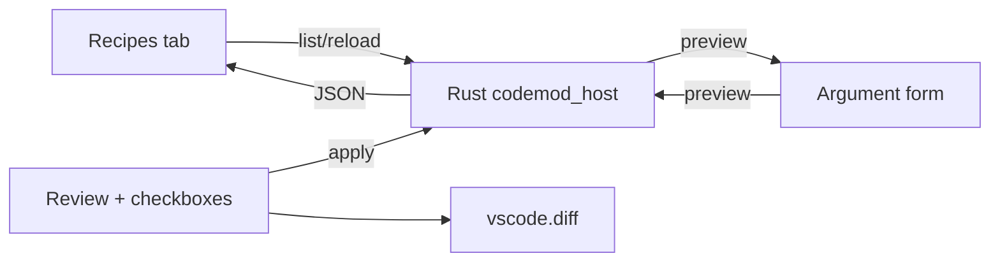

# Codemod Recipe — VS Code Extension

A GUI for the [`codemod_recipe`](../README.md) toolkit. Browse recipes, fill in
placeholder values through a form, preview changes as a native diff, and choose
exactly which edits to keep before applying.

Supports **multi-language** recipes (Dart, Rust, Java, Kotlin, SQL, TypeScript,
JavaScript, Python, and 300+ tree-sitter grammars via the Rust host).

## How it works

The extension does not parse source files itself. It launches the **Rust
`codemod_host`** binary (tree-sitter engine) and talks to it over a
JSON-over-stdio protocol.


```mermaid
flowchart LR
    RecipesTab["Recipes tab"] -->|list/reload| Host
    Form["Argument form"] -->|preview| Host
    Review["Review + checkboxes"] -->|apply| Host
    Host["Rust codemod_host"] -->|JSON| RecipesTab
    Host -->|preview| Form
    Review --> Diff["vscode.diff"]
```

**Default:** bundled `codemod_host` from `vscode_extension/bin/` (built via
`build.sh` from `rust/`). **Dev fallback:** `cargo run -p codemod_recipe_host
--bin codemod_host` when no binary is present.

## Setup

### YAML recipes

1. Create a `.codemod/` directory in your workspace root — or run
   **Codemod Recipe: Scaffold Project** (also offered when `.codemod` is missing).
2. Add YAML recipe files (`.yaml` or `.yml`) under `.codemod/` (conventionally
   `.codemod/recipes/`). Each recipe must have `id:` and `steps:`.
   Use dotted ids like `rust.data.add_log_line` to organize the Recipes tab tree.
3. Optionally add maps (`id` + `map:`), variables (`id` + `values:`), and templates
   (e.g. under `.codemod/maps/`, `.codemod/variables/`, `.codemod/templates/`).
4. Build and install the extension from `vscode_extension/` (`./build.sh`, or
   `npm run compile` then package/install the VSIX).
5. Open your project in VS Code and configure settings if needed:

```jsonc
// .vscode/settings.json
{
  "codemodRecipe.codemodRoot": ".codemod",
  "codemodRecipe.workspaceRoot": "",
  "codemodRecipe.autoPreviewDebounceMs": 400,
  "codemodRecipe.previewSnippetLines": 5
}
```

All YAML, `.template`, and `.scm` files under the codemod root are automatically
discovered and reloaded when changed (file-system watch plus reload on editor
save). Recipe load errors appear in the Recipes tab and the Problems panel.
Use **Re-scan recipes** only if the catalog looks stale after adding files outside
the watched patterns or after a host restart failure.

JSON Schema files under `schemas/` validate recipe/map/variable YAML (via
`contributes.jsonValidation`, and Red Hat YAML `yaml.schemas` when that extension
is installed).

### Syntax highlighting

Recipe YAML keeps the built-in `yaml` language mode. The extension injects a
TextMate grammar that assigns **scopes** (not fixed colors) to known DSL keys
and values — for example `keyword.control.codemod-recipe.step` for `edit` /
`create`, `storage.type.codemod-recipe.op` for `insert` / `replace` / `remove`,
and `entity.name.tag.codemod-recipe.field` for fields like `query` and `capture`.
Your active color theme maps those scopes to colors, so Dark+, Light+, High
Contrast, and third-party themes all work without extension-shipped hex colors.

To customize further, override scopes in user or workspace settings:

```json
"editor.tokenColorCustomizations": {
  "textMateRules": [
    {
      "scope": "keyword.control.codemod-recipe.step",
      "settings": { "foreground": "#C586C0", "fontStyle": "bold" }
    }
  ]
}
```

Useful scopes: `keyword.control.codemod-recipe.step`,
`storage.type.codemod-recipe.op`, `entity.name.tag.codemod-recipe.field`,
`constant.language.codemod-recipe.enum`.

### Custom codemod root

To use a different directory than `.codemod`, set `codemodRecipe.codemodRoot` in
settings or use **Codemod Recipe: Set Codemod Root Directory**.

## Usage

1. Open the **Codemod Recipe** view in the activity bar. The side view has
   **Recipes** and **Recipe Runner** tabs.
2. Search or expand folders derived from dotted recipe ids in the **Recipes** tab, then click a recipe to
   open the runner. Right-click a recipe and choose **Show Recipe** when the host reports a `sourceFile`.
3. The **Recipe Runner** tab shows parameter metadata and runs live preview
   automatically as form values change.
4. The review panel shows changed files with short snippets and per-file/per-patch
   selection controls.
5. Use **Previous Change**, **Next Change**, or click a patch row to step through
   changes and open the native side-by-side diff for that file.
6. Uncheck any files or patches you do not want, then click **Apply Selected**.

### Keyboard shortcuts

Bind recipes to chords via **slots** (`codemodRecipe.slots`) or
`codemodRecipe.invoke`. Args can auto-fill from the editor with recipe `from:` /
`contextKey`. Full guide: [docs/recipe-shortcuts.md](../docs/recipe-shortcuts.md).

Explorer: right-click a file/folder → **Codemod Recipe ▸ Run Recipe Here…**
(auto-apply when args complete) or **Open in Recipe Runner…** for recipes that
declare `explorerMenu` (see the shortcuts doc).

Example workspace settings:

```jsonc
{
  "codemodRecipe.slots": {
    "1": "my.feature.recipe",
    "b": "flutter.add_bloc"
  }
}
```

Default chords: `Ctrl+Shift+I` then `1` (run/auto), `Ctrl+Shift+T` then `1` (open runner).

### Editor navigation (Recipe Language Toolkit)

Under `codemodRecipe.codemodRoot` (default `.codemod/**`) YAML files:

- **Structural completions** from `generated-dsl-surface.json` (codegen from Rust
  `dsl_structure` / model) — e.g. after `recipe:` + newline, keys like `id` /
  `with` / `if` / `ifNot`
- **Runtime completions** — recipe ids, `language:` ids, and `with:` arg names from
  the host catalog / `describe` (not hand-maintained lists)
- **Go to Definition** on `recipe:` / nested `id:` and `templateFile:` (recipe-local
  then codemod root)
- **Hover** on DSL keywords, recipe ids, and template previews
- **CodeLens** on the **top-level** `id:` only: Open in Recipe Runner, Copy invoke
  keybinding, Assign to slot…; one **Test query on file…** lens per recipe
- **Diagnostics** come from the Rust host validate of **saved** files (Problems
  panel source `codemod-recipe`)

DSL structure for editors: edit `model.rs` + `dsl::` + `dsl_structure` + `ENTRIES`
prose, then run `scripts/generate-dsl-artifacts.sh` (schema, surface, keyword-docs,
TextMate). Do not hardcode container children in TypeScript.

You can also run **Codemod Recipe: Run From Cursor Context** (`Cmd+Alt+R` on
macOS, `Ctrl+Alt+R` elsewhere). Context keys include `file`, `selection`, `word`,
`dartClass`, and generic `className`.

**Codemod Recipe: Restart Host** restarts the Rust host process.
**Codemod Recipe: Scaffold Project** writes skills/rules and `.codemod/` scaffolding.

## Protocol reference

Commands accepted by the host (one JSON object per line on stdin):

```jsonc
{ "command": "list" }

{ "command": "validate" }

{ "command": "bootstrap", "force": false }

{ "command": "preview", "recipe": "add_log_line",
  "args": { "file": "lib/foo.dart", "className": "Foo", "methodName": "bar" },
  "snippetLines": 5 }

{ "command": "diff", "recipe": "add_log_line", "path": "lib/foo.dart",
  "args": { "file": "lib/foo.dart", "className": "Foo", "methodName": "bar" } }

{ "command": "apply", "recipe": "add_log_line",
  "args": { "file": "lib/foo.dart", "className": "Foo", "methodName": "bar" },
  "previewToken": "<from preview>",
  "selection": { "files": { "lib/foo.dart": { "include": true, "patches": [0] } } } }
```

Omitting a file from `selection.files` keeps all of its patches. Setting
`include: false` (or an empty `patches` list) drops the file.

## Development

```bash
cd vscode_extension
npm install
npm run compile          # build Vue webview + type-check extension to dist/
npm run watch            # rebuild extension host on change
npm run watch:webview    # rebuild webview UI (media/recipeView.js) on change
npm run test:webview     # unit tests for webview arg/selection helpers
./build.sh               # release Rust host + package VSIX
```

The sidebar UI lives in [`src/webview/`](src/webview/) (Vue 3 + Vite) and compiles
into [`media/recipeView.js`](media/recipeView.js) and [`media/recipeView.css`](media/recipeView.css).
Shared message types and constants used by both the extension host and webview are in
[`src/shared/`](src/shared/). Run `npm run build:webview` (or full `npm run compile`) before `F5`
if you change webview sources.

The files in `media/` (`recipeView.html`, `recipeView.js`, `recipeView.css`) are
**built artifacts**: edit sources under `src/webview/`, then compile.

```bash
# Integration smoke test against the Rust host (requires cargo):
node scripts/smoke.mjs
```

Press `F5` in VS Code (with this folder open) to launch an Extension
Development Host for manual testing.

### Manual smoke checklist (webview)

1. Open **Codemod Recipe** — **Recipes** tab lists recipes from the host (grouped/searchable).
2. Select a recipe — **Recipe Runner** tab opens with the argument form.
3. Edit args — preview status updates; review panel appears when the host returns files.
4. **Previous Change** / **Next Change** — active patch highlights; native diff opens.
5. Toggle file/patch checkboxes — **Apply Selected** enables when preview is current.
6. **Browse…** on file/directory args — path fills in and preview re-runs.
7. Switch tabs — form values and review state persist (no full page reload).
